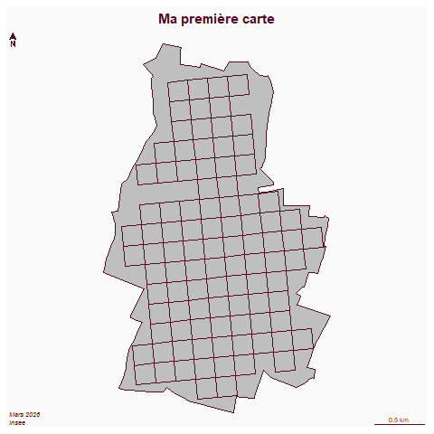

```{r setup, include=FALSE}
knitr::opts_chunk$set(echo = TRUE)
```

# Objet

Présenter un premier script et l'intégration d'une image (carte)

# Librairies

```{r}
library(sf)
library(mapsf)
```


# Données
## commune et carreau
## carreau

```{r}
toto <- "ma donnée"
```


```{r}
st_layers("base.gpkg")
```

commune et carreau

```{r}
nantes <- st_read("base.gpkg", "commune")
nantes <- nantes [nantes$code == 44109,]
car <- st_read("base.gpkg", "car")
car <- car [car$lcog_geo == 44109,]
```


# Cartograhie


```{r}

mf_map(nantes)
mf_map(car, col = "lightblue", add = TRUE)
mf_layout("Ma première carte", "Mars 2026\nInsee")
```

